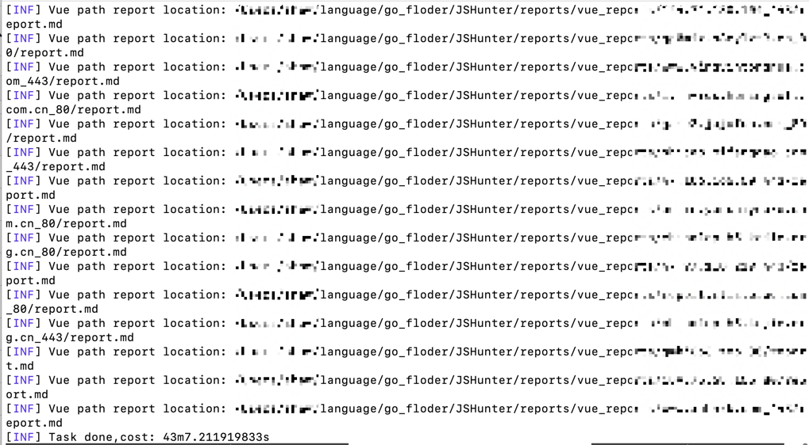
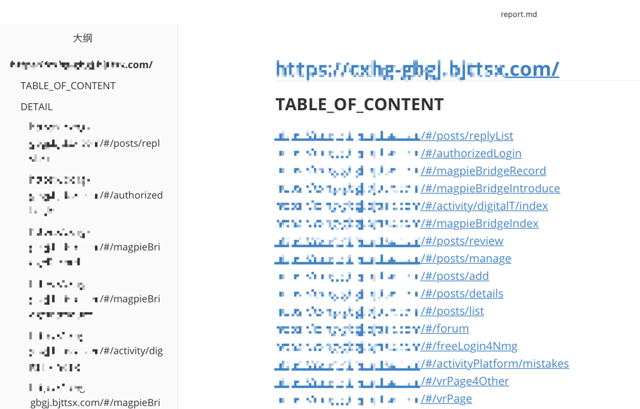
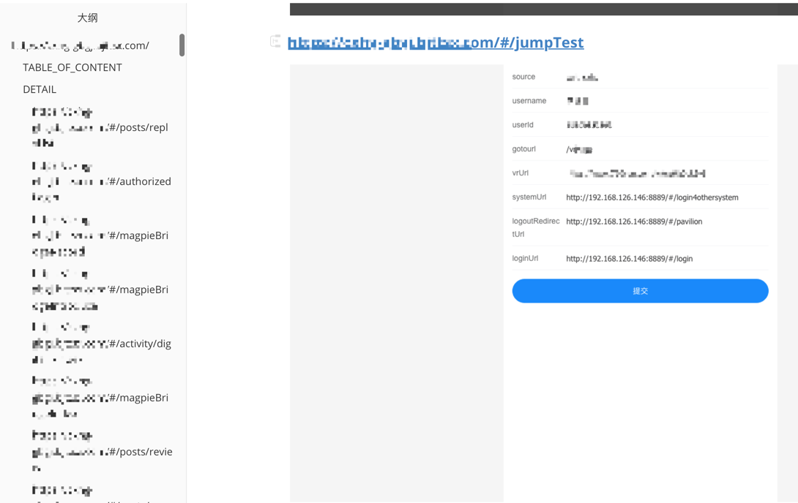

<h2 align="center">JSHunter-一款针对于前端的未授权访问扫描工具</h2>

## 介绍

该工具是一款针对于前端的未授权访问扫描工具, 其主要任务为：
1. 发现网站中的路由并尝试寻找路由守卫缺失的页面(主要功能)
2. 提取网页JS中的API接口信息并使用AI构造接口相关的参数/JS敏感信息查找(测试功能)

如果你想详细了解该工具的设计背景和思路, 可以阅读公众号文章： https://mp.weixin.qq.com/s/heHRbbemwVAMcEYX2NhQuQ

Webpack相关渗透参考文章：

[基于Vue开发的前端系统中寻找后端API及其参数](https://xz.aliyun.com/t/14686?time__1311=GqAhYKBKAIqjx05DKA4YuOODgmRoGOfeD)

[基于未授权的渗透测试技巧总结](https://forum.butian.net/share/3086)


## 安装和使用

### 安装

```shell
git clone https://github.com/N0el4kLs/JSHunter.git
```

编译二制文件
```shell
make build
```
或者
```
go build -o jshunter cmd/js-hunter/main.go
```

### 使用
```text
     ________ __          __         
 __ / / __/ // /_ _____  / /____ ____
/ // /\ \/ _  / // / _ \/ __/ -_) __/
\___/___/_//_/\_,_/_//_/\__/\__/_/  v0.4.2
			author by: Noel4kls	 
A tool to find vulnerabilities in javascript files

Usage:
  ./js-hunter [flags]

Flags:
INPUT:
   -u, -url string   URL to find vulnerabilities in javascript files
   -f, -file string  File containing URLs to find vulnerabilities in javascript files

OPTIONS:
   -ac               Check both endpoints and vue paths
   -ec               Check for endpoints
   -vc               Check for vue paths
   -ai string        AI source to use for extracting endpoints.Only support gemini and gpt3 for now.
   -env string       dot env file that store necessary token (default ".env")
   -T, -threads int  Number of threads to use for the scanner (default 50)

DEBUG:
   -debug     Enable debug mode
   -headless  enable headless browser while running
```

该工具提供了**两种输入方式,** 你可以使用：
1. `-u`来指定特定的URL
2. `-f`来指定一个文件, 该文件中包含了带检测的多个URL

该工具提供了**两种检测模式**, 你可以使用：
1. `ec`用来检测api接口(beta)
2. `cv`用来检测vue路径
3. `-ac`来同时检测端点和Vue路径

关于 `-ec` api接口检测模式, 由于该检测模式以来AI模型, 因此你需要指定AI模型的来源, 目前只支持`gemini` ~~和`gpt3`两~~ 一种模型.
> openai 接口目前收费, 还未做大规模测试, 所以目前支持gemini.

使用`-ec`检测前, 您需要先配置好 `gemini` 的 `API KEY`, 同时 `gemini`是需要外网访问的, 为防止某些网站在全局代理无法访问, 你也可以在 `.env`中
配置好本地的代理地址.

配置流程:
```shell
cp .env.example .env
```
参考 `.env` 将里面的内容替换就好

>⚠️注意: `ec` 接口检测模块属于该工具的试验功能, 暂不推荐该参数作为常用参数使用


### 使用案例

检测 `http://exmaple.com`中的路由守卫缺失
```shell
./js-hunter -u "http://exmaple.com" -vc
```

检测 `http://exmaple.com`中的接口问题(实验功能)
```shell
./js-hunter -u "http://exmaple.com" -ec -ai gemini -env .env
```

同时检测 `http://exmaple.com`中的接口问题和路由守卫缺失问题(实验功能)
```shell
./js-hunter -u "http://exmaple.com" -ac -ai gemini -env .env
```

>  ✍️建议：该工具用来探测登陆页面效果更加

### 运行截图




## 仍然存在的问题

1. 未记录请求超时的地址
2. 潜在bug

如果你有相关想法或BUG反馈，欢迎👏ISSUE.

## Todo
- [ ] 增加常见的敏感信息匹配规则
- [ ] 优化Prompt及其对内容的处理

## 参考

[Packer-Fuzzer-一款针对Webpack等前端打包工具所构造的网站进行快速、高效安全检测的扫描工具
](https://github.com/rtcatc/Packer-Fuzzer)

[vueinfo-Extract info from Vue based website](https://github.com/phith0n/vueinfo)


**免责声明： 本工具仅供教育和授权测试目的使用。开发者及贡献者不支持、不鼓励也不赞成任何非法或未经授权的使用。 
用户有责任确保其使用本工具的行为符合所有适用的法律法规。严禁将本工具用于任何未经授权的活动。 
开发者及贡献者对使用本工具造成的任何损害或后果不承担责任。使用前请自行承担风险。 通过使用本工具，您同意这些条款，并对您的行为承担全部责任。**
